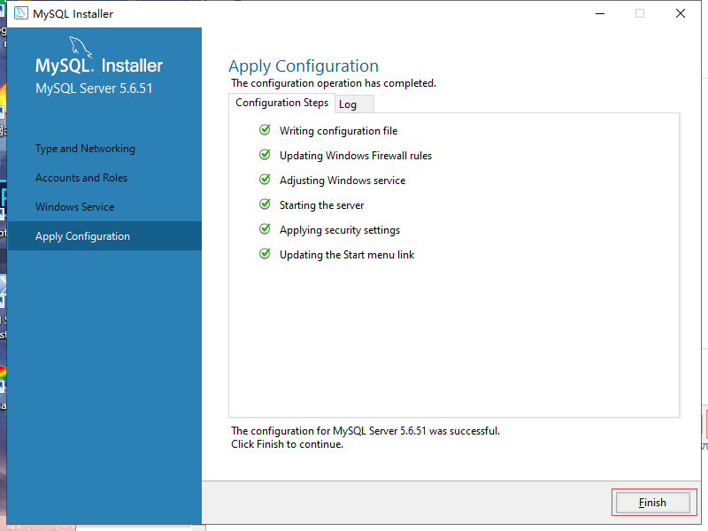

## MySQL简单学习

#### 安装

选中5.7.33版本，我这里因为已经安装过了，所以是灰色的

我这里用5.6版本代替，演示过程

之后右面显示我们要安装的内容，然后next

打开数据库

右击此电脑->管理

#### 创建数据库

create database <数据库名>;

#### 查看数据库

show databases;

#### 删除数据库

drop database <数据库名>;

#### 创建数据表

create table newtable(
     user int primary key,
     name varchar(50)
     );

create table newtable(
     user int,
     name varchar(50),

​     primary key(user)

​     );

#### 查看数据表

show tables;

#### 删除数据表

drop table <数据表名>;

#### 插入数据

insert into newtable(user,name) values(120,"Tom");

#### 删除数据

delete from newtable

where user=120;

#### 更改数据

update newtable
    set name="Bob"
     where user=120;

#### 查找数据

select * from newtable;

#### 数据类型

int

double

varchar()

#### where语句

where后跟条件，匹配出符合条件的数据项（条件格式：属性=值）

可以用 or 和and 拼接多个条件

#### like语句

like可以进行近似匹配，用%作为通配符，使更多的结果可以返回回来